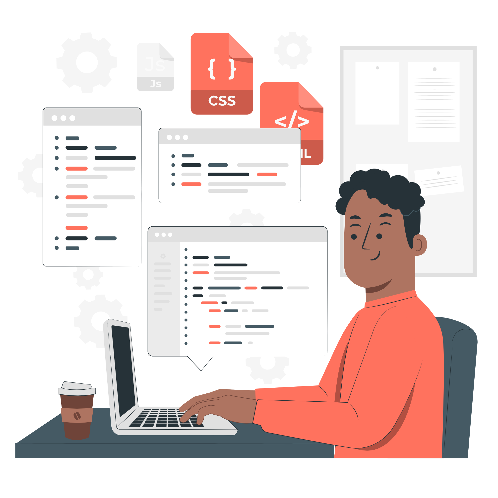

my first responsive landing page.
# 🌐 Frontend Development Landing Page

A simple and responsive **landing page** built only with **HTML** and **CSS**.  
This project is a beginner-friendly portfolio-style page to practice frontend development skills.

---

## 📸 Preview

---

## ✨ Features
- Fully responsive design  
- Clean and modern UI  
- Navigation bar (Home, About, Works, Blogs, Contact)  
- Hero section with heading, text, and buttons  
- Easy to customize  

---

## 🛠️ Technologies Used
- **HTML5**  
- **CSS3**  

---

## 👩‍💻 Author
Created with ❤️ by **Farah Saleem**  
- GitHub: [Farah-Saleem270](https://github.com/Farah-Saleem270)