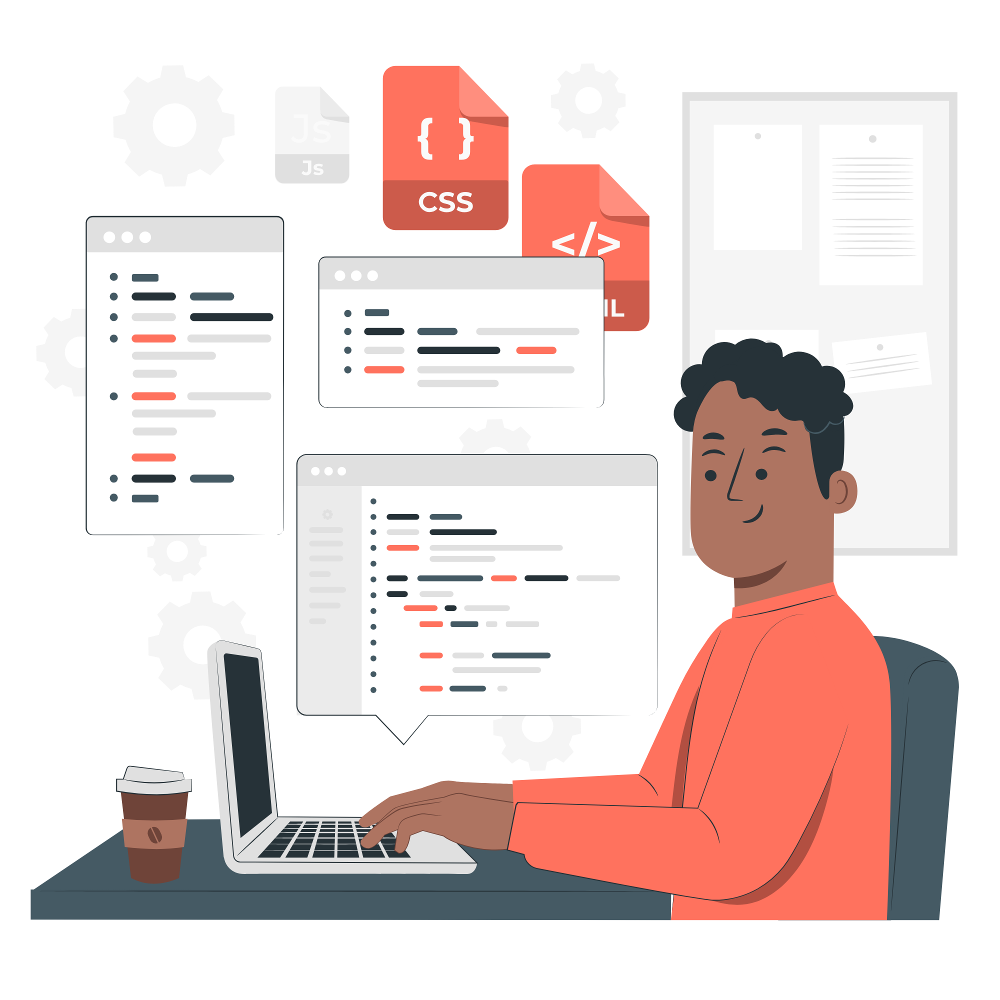
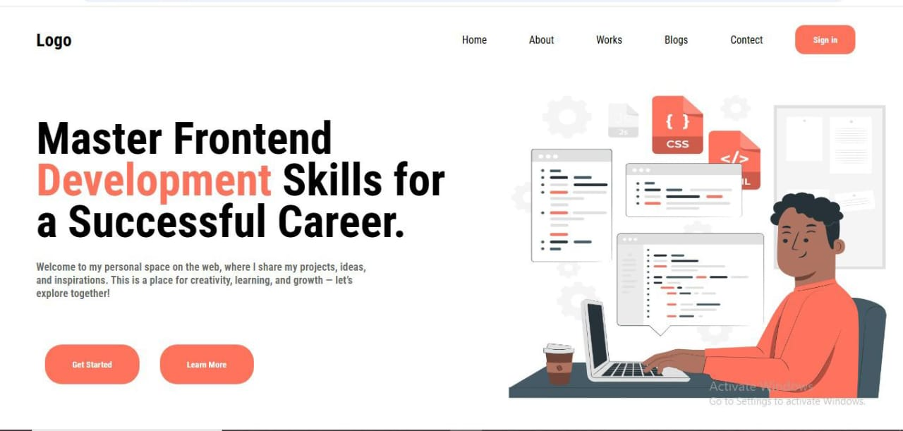
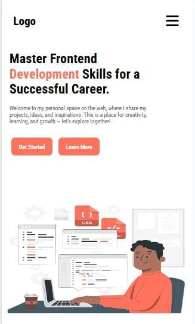

# 🌐 Responsive Landing Page (HTML & CSS)

A simple and fully responsive **landing page** built using only **HTML** and **CSS**.  
This project is beginner-friendly and great for practicing responsive layouts.

---

## 📸 Preview

### 🎨 Background Image

### 💻 Laptop View

### 📱 Mobile View

---

## ✨ Features
- Fully responsive design (desktop & mobile)  
- Modern and clean UI layout  
- Hero section with heading, text, and buttons  
- Navigation bar with smooth design  
- Easy to customize with CSS  

---

## 🛠️ Technologies Used
- **HTML5**  
- **CSS3**  

---

## 📂 Project Structure

/responsive-landing-page  
│── index.html  
│── style.css  
│── background.png  
│── laptop-view.jpeg  
│── mobile-view.jpeg  
│── README.md  

---

## 🚀 How to Use
1. Clone or download this repository  
2. Open `index.html` in your browser  
3. Resize the browser window to see responsive design in action  
4. Customize text, colors, and background as you like  

---

## 👩‍💻 Author
Created with ❤️ by **Farah Saleem**  
- GitHub: [Farah-Saleem270](https://github.com/Farah-Saleem270)
